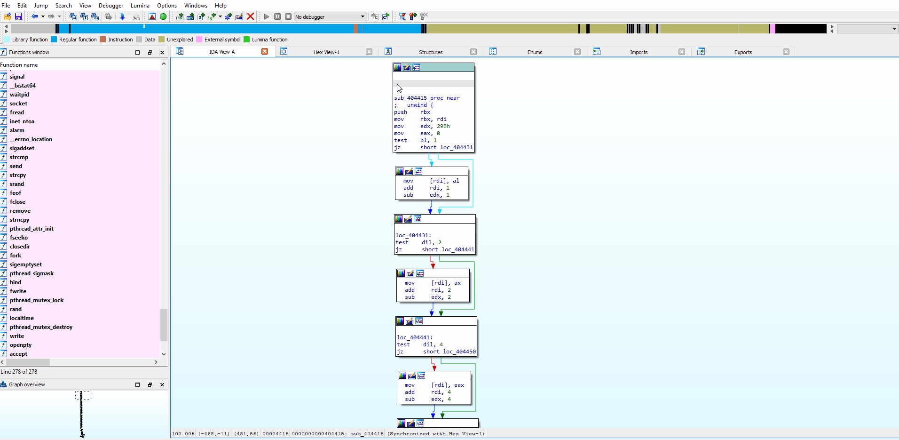

# YarG for Yara
## Yet another rule generator for Yara

IDAPython plugin for generating whole yara rules/ patterns from x86/x86-64 code. Operation called 'parameterization' 
applyes to selected code/function. This operation finds alternatives for any possible operands and create pattern 
based on that information. 

Example rule you can found in examples folder.

Tested on IDA 7.5+

## Installation

Copy plugin to your **IDA_HOME/plugins** folder and install dependencies.
~~~
    pip install capstone tabulate
~~~

## How it work ?

According to intel manual a instruction have the following structure

| Instruction prefix | Opcode | Mod R/M | SIB | Displacement | Immediate value |
| -------------------|--------|---------|-----|--------------|-----------------|

Let's consider that parts.

#### Instruction prefix

Currently only the REX prefix parameterized as **4?**.

#### Mod R/M

| Mod  | Reg  | R/M  |
|------|------|------|
| 2bit | 3bit | 3bit |

For every instruction contained **Mod R/M** byte the plugin creates a list of candidates on ModR/M positions 
uses following rules
 * *Mod* are fixed
 * *Reg* If accorded settings enabled, the plugin creates 8 possible candidates (0b000 to 0b111)
 * *R/M* If accorded settings enabled, the plugin creates 8 possible candidates (0b000 to 0b111)
 
So, 4 generation available
 * *Mod* |  ???  | ???
 * *Mod* | *REG* | ???
 * *Mod* | *REG* | *R/M*
 * *Mod* |  ???  | *R/M*
 
Besides, you can choose particular registers for parameterization

#### Scale/Index/Base

SIB byte parametersized the same way as **Mod R/M** byte but *Scale* fixed instead *Mod*

| Scale | Index | Base  |
|-------|-------|-------|
| 2bit  | 3bit  | 3bit  |

#### Displacement and Immediate value

If Displacement/Immediate value is an address or offset special trick are used. Because actual code placed in 
small range of addresses, some bytes can be fixed (last 2 or 1 byte).

## References

* [Intel® 64 and IA-32 ArchitecturesSoftware Developer’s ManualVolume 2 (2A, 2B, 2C & 2D):Instruction Set Reference, A-Z](https://www.intel.com/content/dam/www/public/us/en/documents/manuals/64-ia-32-architectures-software-developer-instruction-set-reference-manual-325383.pdf "Intel manual")
* [OS Dev wiki: X86-64_Instruction_Encoding](https://wiki.osdev.org/X86-64_Instruction_Encoding "OSDev wiki")
* [Opcode table for x86](http://ref.x86asm.net/coder32.html "Opcode table for x86")
* [Yara docs](https://yara.readthedocs.io/en/stable/writingrules.html#private-strings "Yara docs")
